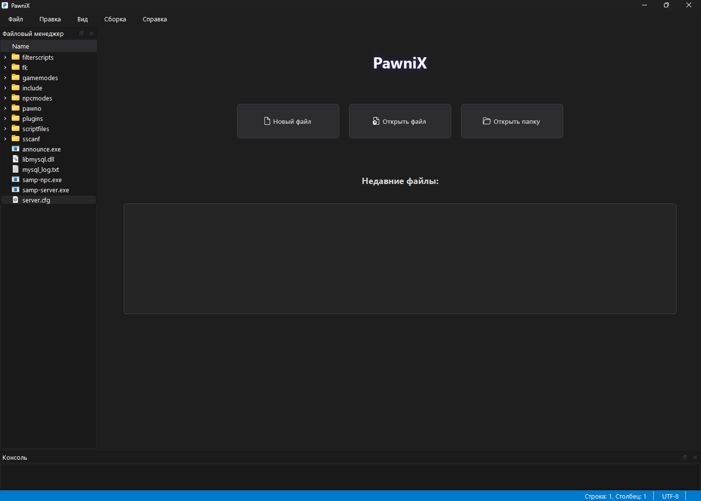
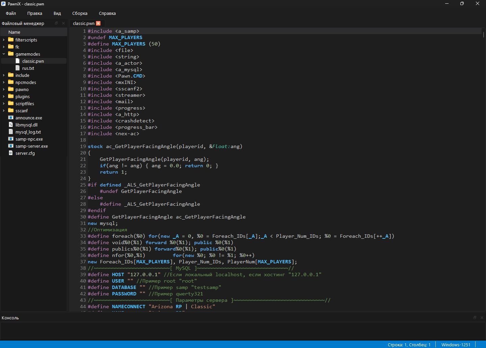

# PawniX


<p align="center">
  
  
</p>

**PawniX** — современный редактор кода для языка Pawn, разработанный специально для создания модификаций San Andreas Multiplayer (SA-MP). Редактор сочетает в себе минималистичный дизайн с мощными функциями для профессиональной разработки.

## ✨ Особенности

### 🎨 Современный интерфейс
- **Темная тема** с настраиваемой цветовой палитрой
- **Вкладки** для удобной работы с несколькими файлами
- **Файловый менеджер** с древовидным представлением

### 💻 Продвинутый редактор
- **Подсветка синтаксиса Pawn** с кастомизируемыми цветами
- **Нумерация строк** с подсветкой текущей строки
- **Подсветка парных скобок**
- **Закладки** для быстрой навигации
- **Поиск и замена** с поддержкой регулярных выражений
- **Переход к строке**

### ⚙️ Интегрированные инструменты
- **Встроенный компилятор Pawn** (pawncc)
- **Консоль вывода** компиляции
- **Информация о кодировке** (UTF-8, Windows-1251)
- **Статистика документа** (количество слов, символов, строк)

### 🔧 Настройки
- **Настраиваемая цветовая палитра** для всех элементов редактора
- **Выбор шрифта** и размера текста
- **Автосохранение** с конфигурируемым интервалом
- **История недавних файлов**
- **Настройки компилятора**

## 🚀 Установка и компиляция

### Предварительные требования

1. **Qt 5.15+** или **Qt 6.x**
2. **Компилятор C++** с поддержкой C++17:
   - MinGW (Windows)
   - MSVC (Windows)
   - GCC (Linux/macOS)
3. **CMake 3.16+** или **qmake**

### Компиляция на Windows

#### Вариант 1: Использование Qt Creator
1. Установите [Qt Creator](https://www.qt.io/download) с компонентами Qt 6.9+
2. Откройте файл `CMakeLists.txt` или `pawnix.pro` в Qt Creator
3. Выберите комплект (kit) с MinGW или MSVC
4. Нажмите **Собрать проект**

#### Вариант 2: Компиляция через CMake
```bash
# Создайте директорию для сборки
mkdir build
cd build

# Генерация проекта
cmake .. -G "MinGW Makefiles" -DCMAKE_PREFIX_PATH="C:/Qt/5.15.2/mingw81_64"

# Компиляция
cmake --build . --config Release
